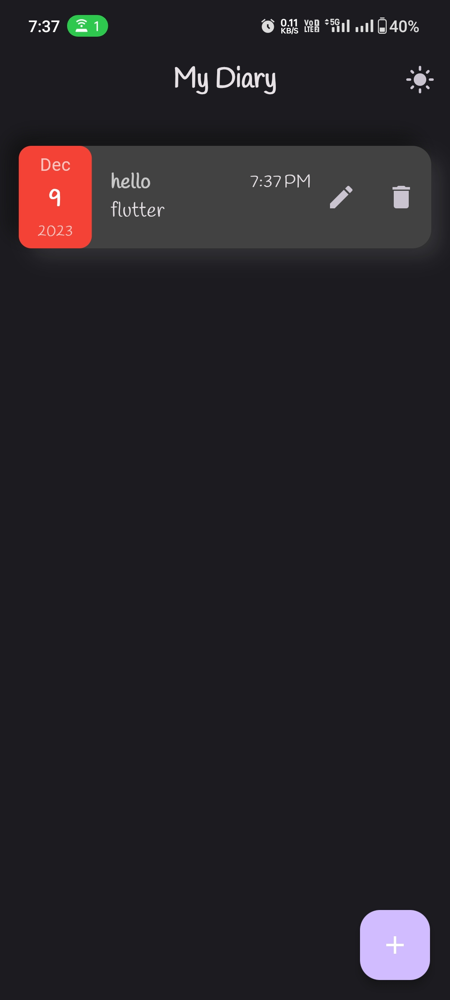

# Notes App

Welcome to your Notes App! A sleek and feature-rich Notes management application developed using Dart and Flutter. Whether you're organizing your Collection of Notes, editing those notes, adding new ones, or deleting notes, this app provides an intuitive and customizable experience.

## Screenshots

### Home Screen

#### Light Mode

#### Dark Mode

#### Home Screen With Notes

### Edit Note Screen

### Add Note Screen

#### With Typing Off

#### With Typing On

### Delete Note Confirmation Screen

## Features

- **Intuitive Design**: Simple and easy-to-use interface for seamless Notes management.
- **Light and Dark Modes**: Choose between light and dark modes for a personalized experience.
- **Edit Note**: Easily edit tasks to keep your to-do list notes up-to-date.
- **Add Note**: Quickly add new note with relevant details.
- **Delete Note**: Remove a note with the dedicated "Delete" button on each task, triggering a confirmation screen.

## Libraries Used

- **intl**: For internationalization and localization.
- **sqflite**: SQLite database plugin for Flutter.
- **path**: A library for handling file and directory paths.

## Getting Started

1. Create a new Flutter app.
2. Open the app in your preferred Dart and Flutter development environment and add pages as per the folder structure provided below and go on to customize as per need and learn more by practicing things out.
3. Customize and enhance the app according to your requirements.
4. Routes:
   - `lib/models/note.dart`
   - `lib/repository/notes_repository.dart`
   - `lib/screens/add-note/add_note_screen.dart`
   - `lib/screens/edit_note/edit_note_screen.dart`
   - `lib/screens/home/widgets/item_note.dart`
   - `lib/screens/home/home_screen.dart`
   - `lib/main.dart`

## Dependencies

- [intl](https://pub.dev/packages/intl)
- [sqflite](https://pub.dev/packages/sqflite)
- [path](https://pub.dev/packages/path)

## Contributing

Keep contributing and improving yourself and to the development of the Notes App.

Happy Noteinggg !!

❤❤

